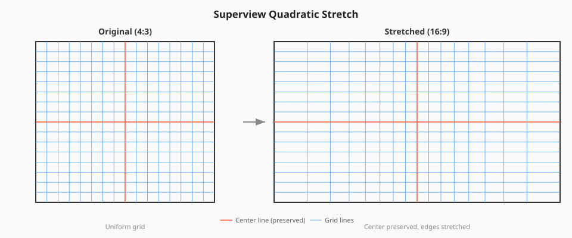

<p align="center">
  
</p>

<p align="center">
  A CLI tool that dynamically stretches 4:3 video to 16:9 using a non-linear quadratic algorithm.<br/>
  The center of the frame is preserved while the edges are progressively stretched.
</p>

---

## How it works

Unlike a simple linear stretch that distorts the entire image uniformly, superview-rs applies a **quadratic curve** to the horizontal remapping. The center of the frame stays nearly untouched while the edges absorb most of the stretch.

<p align="center">
  
</p>

The tool generates pixel remap files and uses ffmpeg's `remap` filter to produce the output. Squeeze mode (`-s`) applies the exact mathematical inverse of the stretch curve, so a stretched video can be recovered back to its original 4:3 proportions.

Audio is copied through untouched, unless its codec cannot be muxed into the output container (e.g. Vorbis or PCM into mp4), in which case it is re-encoded to AAC with a warning. Metadata, color tags (including 10-bit HDR pixel formats), and data streams such as GoPro telemetry are preserved, and rotation metadata is respected — rotated footage is processed in its display orientation.

## Requirements

- [Rust](https://rustup.rs/) (to build)
- [ffmpeg](https://ffmpeg.org/download.html) (runtime dependency)

On Windows, either place `ffmpeg.exe` and `ffprobe.exe` in the same folder as `superview-rs.exe`, or use the `--ffmpeg-path` flag. On Linux/macOS, installing ffmpeg via your package manager is usually enough.

## Installation

```sh
cargo build --release
```

The binary will be at `target/release/superview-rs`.

## Usage

```sh
# Basic usage (outputs to input_superview.mp4, uses CRF quality mode)
superview-rs -i input.mp4

# Process multiple files in one run (outputs derived per file)
superview-rs -i clip1.mp4 clip2.mp4 clip3.mp4

# Specify output file
superview-rs -i input.mp4 -o stretched.mp4

# Choose encoder and preset
superview-rs -i input.mp4 -e libx264 -p slow

# Set quality (lower CRF = better quality, larger file)
superview-rs -i input.mp4 -c 15

# Use bitrate mode instead of CRF (bits/sec, e.g. 100 Mbit/s)
superview-rs -i input.mp4 -b 100000000

# Reverse: squeeze a stretched 16:9 video back to its original 4:3
superview-rs -i stretched.mp4 -o fixed.mp4 -s

# Detect and remove black bars before stretching
superview-rs -i input.mp4 --auto-crop

# Only remove black bars, without stretching
superview-rs -i input.mp4 --auto-crop --no-stretch

# 2x supersampled remapping for better output quality (slower)
superview-rs -i input.mp4 --high-quality
```

## Options

| Flag | Description | Default |
|------|-------------|---------|
| `-i, --input` | Input video file(s) | (required) |
| `-o, --output` | Output video file (single input only) | Input name + `_superview.mp4` |
| `-e, --encoder` | Video encoder (e.g. `libx264`, `libx265`) | Auto-detected from input |
| `-c, --crf` | Constant Rate Factor (quality) | 18 (x265), 23 (x264) |
| `-b, --bitrate` | Bitrate in bits/sec (overrides CRF) | - |
| `-p, --preset` | Encoder preset (e.g. `slow`, `fast`) | Encoder default |
| `-s, --squeeze` | Reverse stretch mode (16:9 back to 4:3) | `false` |
| `--auto-crop` | Detect and remove black bars before stretching | `false` |
| `--no-stretch` | Crop only, skip stretching (requires `--auto-crop`) | `false` |
| `--high-quality` | 2x supersampled remap for better quality | `false` |
| `-y, --overwrite` | Replace the output file if it already exists | `false` |
| `--ffmpeg-path` | Path to ffmpeg binary | Auto-detected |
| `--hw-decode` | VAAPI hardware decoding (Linux) | `false` |
| `--vaapi-device` | DRM render node for VAAPI encoders | Auto-detected |

## CPU vs hardware encoding

By default everything runs on the CPU with a software encoder, which gives the best
quality per file size. This is the right choice when quality matters more than time:

```sh
# CPU encode + CPU decode (default, best quality per size)
superview-rs -i input.mp4

# Same, but trade some quality for a 2-3x faster encode
superview-rs -i input.mp4 -p faster
```

Passing a hardware encoder with `-e` offloads the encoding to the GPU, which is
significantly faster at high resolutions. Which `-e` value to use depends on your
GPU and platform:

| GPU / Platform | H.264 | H.265/HEVC |
|----------------|-------|------------|
| AMD or Intel on Linux (VAAPI) | `h264_vaapi` | `hevc_vaapi` |
| NVIDIA (NVENC) | `h264_nvenc` | `hevc_nvenc` |
| Intel (QuickSync) | `h264_qsv` | `hevc_qsv` |
| AMD on Windows (AMF) | `h264_amf` | `hevc_amf` |
| macOS (VideoToolbox, bitrate mode only) | `h264_videotoolbox` | `hevc_videotoolbox` |

If unsure, pick the HEVC variant for the first matching row; the startup banner
lists every encoder your ffmpeg build supports.

```sh
# GPU encode on AMD/Intel under Linux (render node in /dev/dri is auto-detected)
superview-rs -i input.mp4 -e hevc_vaapi -c 24

# GPU encode + GPU decode: lowest CPU usage
superview-rs -i input.mp4 -e hevc_vaapi -c 24 --hw-decode

# CPU encode + GPU decode: keep libx265 quality but offload the decoding
superview-rs -i input.mp4 --hw-decode

# GPU encode on NVIDIA
superview-rs -i input.mp4 -e hevc_nvenc -c 24
```

Notes:

- In CRF mode the value is passed to hardware encoders as a constant QP. They
  produce larger files than libx265 at the same number, so consider raising it
  (e.g. `-c 24`).
- `--hw-decode` (Linux/VAAPI only) offloads decoding of the input to the GPU. The
  remap filter itself always runs on the CPU, so this mainly reduces CPU load
  rather than total encode time; it helps most on machines where CPU cores are the
  bottleneck. If no device can hardware-decode the input, the tool falls back to
  software decoding with a warning.
- `--vaapi-device` overrides the auto-detected render node for both VAAPI encoding
  and `--hw-decode`.
- VAAPI encoders have no presets, so `-p` is ignored with a warning there.

## CRF defaults

| Encoder | Default CRF |
|---------|-------------|
| libx265 / HEVC | 18 |
| libx264 / H.264 | 23 |
| Other | 28 |

Lower CRF values produce better quality at the cost of larger files.

## License

MIT
